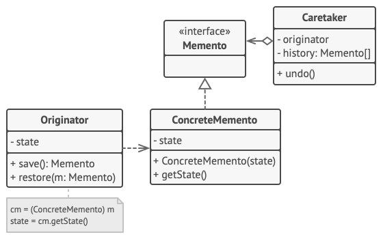

## Memento（备忘录）
> Memento is a behavioral design pattern that allows making snapshots of an object’s state and restoring it in future.
   备忘录是一种行为型设计模式，通过创建对象状态的快照并在将来恢复它

> The Memento’s principle can be achieved using the serialization, which is quite common in Python. While it’s not the only and the most efficient way to make snapshots of an object’s state, it still allows storing state backups while protecting the originator’s structure from other objects.
   备忘录的原理可以使用序列化来实现，这在Python中非常常见。虽然它不是唯一和最有效的方法来制作对象状态的快照，但它仍然允许存储状态备份，同时保护原始对象的结构不受其他对象的影响。
  
意图：在不破坏封装性的前提下，捕获一个对象的内部状态，并在该对象之外保存这个状态。

主要解决：所谓备忘录模式就是在不破坏封装的前提下，捕获一个对象的内部状态，并在该对象之外保存这个状态，这样可以在以后将对象恢复到原先保存的状态。

何时使用：很多时候我们总是需要记录一个对象的内部状态，这样做的目的就是为了允许用户取消不确定或者错误的操作，能够恢复到他原先的状态，使得他有"后悔药"可吃。

如何解决：通过一个备忘录类专门存储对象状态。

关键代码：客户不与备忘录类耦合，与备忘录管理类耦合。

应用实例： 1、后悔药。 2、打游戏时的存档。 3、Windows 里的 ctri + z。 4、IE 中的后退。 4、数据库的事务管理。

优点： 1、给用户提供了一种可以恢复状态的机制，可以使用户能够比较方便地回到某个历史的状态。 2、实现了信息的封装，使得用户不需要关心状态的保存细节。

缺点：消耗资源。如果类的成员变量过多，势必会占用比较大的资源，而且每一次保存都会消耗一定的内存。

使用场景： 1、需要保存/恢复数据的相关状态场景。 2、提供一个可回滚的操作。

注意事项： 1、为了符合迪米特原则，还要增加一个管理备忘录的类。 2、为了节约内存，可使用原型模式+备忘录模式

### 案例一 Implementation based on an intermediate interface

1. In the absence of nested classes, you can restrict access to the memento’s fields by establishing a convention that caretakers can work with a memento only through an explicitly declared intermediary interface, which would only declare methods related to the memento’s metadata.
  > 在没有嵌套类的情况下，您可以通过建立一个约定来限制对memento字段的访问，该约定要求管理员只能通过显式声明的中介接口（该接口只声明与memento的元数据相关的方法）来使用memento字段

2. On the other hand, originators can work with a memento object directly, accessing fields and methods declared in the memento class. The downside of this approach is that you need to declare all members of the memento public.
  > 其次，发起人可以直接使用memento对象，访问memento类中声明的字段和方法。这种方法的缺点是需要将纪念品的所有成员都声明为公共的

[代码code](index.py) 
 
### 参考 Reference

* [ Memento ](https://refactoring.guru/design-patterns/memento)
 
* [菜鸟教程-备忘录模式](https://www.runoob.com/design-pattern/memento-pattern.html)
