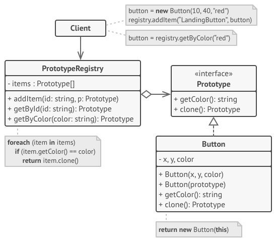

## 原型（Prototype）
> Prototype is a creational design pattern that allows cloning objects, even complex ones, without coupling to their specific classes.
  原型模式一种创建型设计模式，通过“复制”一个已经存在的实例来返回新的实例,而不是新建实例。被复制的实例就是我们所称的“原型”，这个原型是可定制的。

> All prototype classes should have a common interface that makes it possible to copy objects even if their concrete classes are unknown. Prototype objects can produce full copies since objects of the same class can access each other s private fields.
  所有原型类都应该有一个公共接口，即使对象的具体类未知，也可以复制对象。原型对象可以产生完整副本，因为同一类的对象可以访问彼此的私有字段。

意图：用原型实例指定创建对象的种类，并且通过拷贝这些原型创建新的对象。

主要解决：在运行期建立和删除原型。

何时使用： 1、当一个系统应该独立于它的产品创建，构成和表示时。 2、当要实例化的类是在运行时刻指定时，例如，通过动态装载。 3、为了避免创建一个与产品类层次平行的工厂类层次时。 4、当一个类的实例只能有几个不同状态组合中的一种时。建立相应数目的原型并克隆它们可能比每次用合适的状态手工实例化该类更方便一些。

如何解决：利用已有的一个原型对象，快速地生成和原型对象一样的实例。

## 案例

The Prototype Registry provides an easy way to access frequently-used prototypes. It stores a set of pre-built objects that are ready to be copied. The simplest prototype registry is a name → prototype hash map. However, if you need better search criteria than a simple name, you can build a much more robust version of the registry.

原型注册表提供了一种访问常用原型的简单方法。它存储一组准备复制的预构建对象。最简单的原型注册表是名称原型散列映射。但是，如果您需要比简单名称更好的搜索条件，您可以构建一个更健壮的注册表版本

[代码 Demo](./prototype_registry.py)
 
### 参考 Reference

* [Prototype](https://refactoring.guru/design-patterns/factory-method)
 
* [菜鸟教程-原型模式](https://www.runoob.com/design-pattern/prototype-pattern.html)

