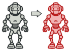
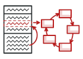

# 设计模式之Python实现

> 本仓库主要参考来源: [DESIGN PATTERNS in Refactoring.Guru](https://refactoring.guru/design-patterns/python)

[中文版](./README-CN.md)

## 创建型模式 

| |创建型模式|||
|:----|:----|:----|:----|
| |抽象工厂 (Abstract Factory)| 允许您生成一系列相关对象，而无需指定它们的具体类. | [代码](./abstract_factory/index.py)|
| |生成器 (Builder) | 逐步构造复杂的对象，通过使用相同的构造代码生成对象的不同类型和表示 | [代码](./builder/index.py)|
| | 工厂方法 (Factory Method) | 提供在超类中创建对象的接口，但允许子类更改将要创建的对象的类型 | [代码](./factory/index.py)
| |原型 (Prototype) | 允许您复制现有对象而不使代码依赖于它们的类.|[代码](./prototype/index.py)|
| |单例 (Singleton) | 确保类只有一个实例，同时为该实例提供全局访问点 | [代码](./singleton/index.py)|

## Structural Patterns

| |Structural Patterns|||
|:----|:----|:----|:----|
| | Adapter | Allows objects with incompatible interfaces to collaborate. |[code](./adapter/index.py)|
| | Bridge | Lets you split a large class or a set of closely related classes into two separate hierarchies—abstraction and implementation—which can be developed independently of each other.|[code](./Bridge/index.py)|
| | Composite | Lets you compose objects into tree structures and then work with these structures as if they were individual objects.|[code](./Composite/index.py)|
| | Decorator | Lets you attach new behaviors to objects by placing these objects inside special wrapper objects that contain the behaviors.|[code](./Decorator/index.py)|
| | Facade | Provides a simplified interface to a library, a framework, or any other complex set of classes.|[code](./Facade/index.py)|
| | Flyweight | Lets you fit more objects into the available amount of RAM by sharing common parts of state between multiple objects instead of keeping all of the data in each object.|[code](./Flyweight/index.py)|
| | Proxy | Lets you provide a substitute or placeholder for another object. A proxy controls access to the original object, allowing you to perform something either before or after the request gets through to the original object.|[code](./Proxy/index.py)|

## Behavioral Patterns

| |Behavioral Patterns|||
|:----|:----|:----|:----|
| | Chain of Responsibility | Lets you pass requests along a chain of handlers. Upon receiving a request, each handler decides either to process the request or to pass it to the next handler in the chain. |[code](./Chain/index.py)|
| | Command | Turns a request into a stand-alone object that contains all information about the request. This transformation lets you parameterize methods with different requests, delay or queue a request's execution, and support undoable operations.|[code](./Command/index.py)|
| | Iterator | Lets you traverse elements of a collection without exposing its underlying representation (list, stack, tree, etc.).|[code](./Iterator/index.py)|
| | Mediator |Lets you reduce chaotic dependencies between objects. The pattern restricts direct communications between the objects and forces them to collaborate only via a mediator object. |[code](./Mediator/index.py)|
| | Memento | Lets you save and restore the previous state of an object without revealing the details of its implementation.|[code](./Memento/index.py)|
| | Observer | Lets you define a subscription mechanism to notify multiple objects about any events that happen to the object they're observing.|[code](./Observer/index.py)|
| | State | Lets an object alter its behavior when its internal state changes. It appears as if the object changed its class.|[code](./State/index.py)|
| | Strategy | Lets you define a family of algorithms, put each of them into a separate class, and make their objects interchangeable.|[code](./Strategy/index.py)|
| | Template Method  | Defines the skeleton of an algorithm in the superclass but lets subclasses override specific steps of the algorithm without changing its structure.|[code](./Template_Method /index.py)|
| | Visitor | Lets you separate algorithms from the objects on which they operate.|[code](./Visitor/index.py)|
