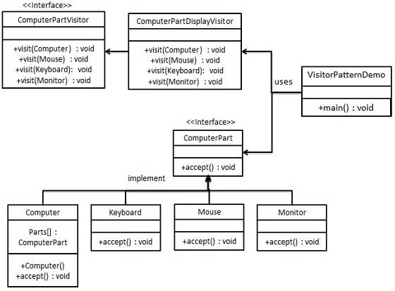

## Visitor (访问者)
> Visitor is a behavioral design pattern that allows adding new behaviors to existing class hierarchy without altering any existing code.
  访问者是一种行为设计模式，它允许在不改变任何现有代码的情况下向现有的类层次结构添加新的行为

意图：主要将数据结构与数据操作分离。

主要解决：稳定的数据结构和易变的操作耦合问题。在不改变数据结构的前提下定义作用于这些元素的新的操作

何时使用：需要对一个对象结构中的对象进行很多不同的并且不相关的操作，而需要避免让这些操作"污染"这些对象的类，使用访问者模式将这些封装到类中。

如何解决：在被访问的类里面加一个对外提供接待访问者的接口。

关键代码：在数据基础类里面有一个方法接受访问者，将自身引用传入访问者。

应用实例：您在朋友家做客，您是访问者，朋友接受您的访问，您通过朋友的描述，然后对朋友的描述做出一个判断，这就是访问者模式。

优点： 1、符合单一职责原则。 2、优秀的扩展性。 3、灵活性。

缺点： 1、具体元素对访问者公布细节，违反了迪米特原则。 2、具体元素变更比较困难。 3、违反了依赖倒置原则，依赖了具体类，没有依赖抽象。

使用场景： 1、对象结构中对象对应的类很少改变，但经常需要在此对象结构上定义新的操作。 2、需要对一个对象结构中的对象进行很多不同的并且不相关的操作，而需要避免让这些操作"污染"这些对象的类，也不希望在增加新操作时修改这些类。

注意事项：访问者可以对功能进行统一，可以做报表、UI、拦截器与过滤器

### 案例一

[代码code](computer.py)

### 参考 Reference

* [ Visitor ](https://refactoring.guru/design-patterns/visitor)
 
* [菜鸟教程-访问者模式](https://www.runoob.com/design-pattern/visitor-pattern.html)

